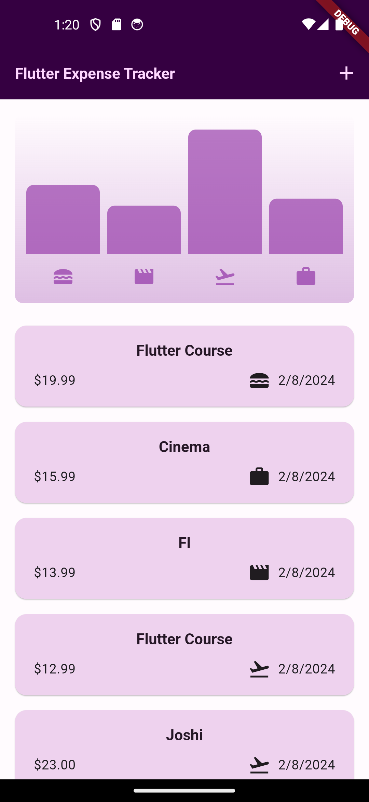

# flutter_expense_tracker

The Flutter expense tracker app is a simple yet powerful tool designed to help users manage their finances efficiently. With its intuitive user interface and robust functionality, users can easily track their expenses, categorize transactions, set budgets, and analyze their spending habits over time.

Key features of the app include:

Expense Tracking: Users can add new expenses with details such as amount, category, date, and description. They can also view and edit existing expenses as needed.

Categories and Tags: Expenses can be categorized into different categories (e.g., groceries, utilities, entertainment) and tagged for better organization and analysis.

Visualizations and Reports: The app provides visualizations such as charts and graphs to help users visualize their spending patterns and identify areas where they can save money.

Data Synchronization: Users can sync their expense data across multiple devices, ensuring that they have access to their financial information wherever they go.

Overall, the Flutter expense tracker app aims to empower users with the tools they need to take control of their finances and make informed decisions about their spending habits. Whether managing personal expenses or tracking business costs, this app provides a convenient and reliable solution for keeping finances in check.

